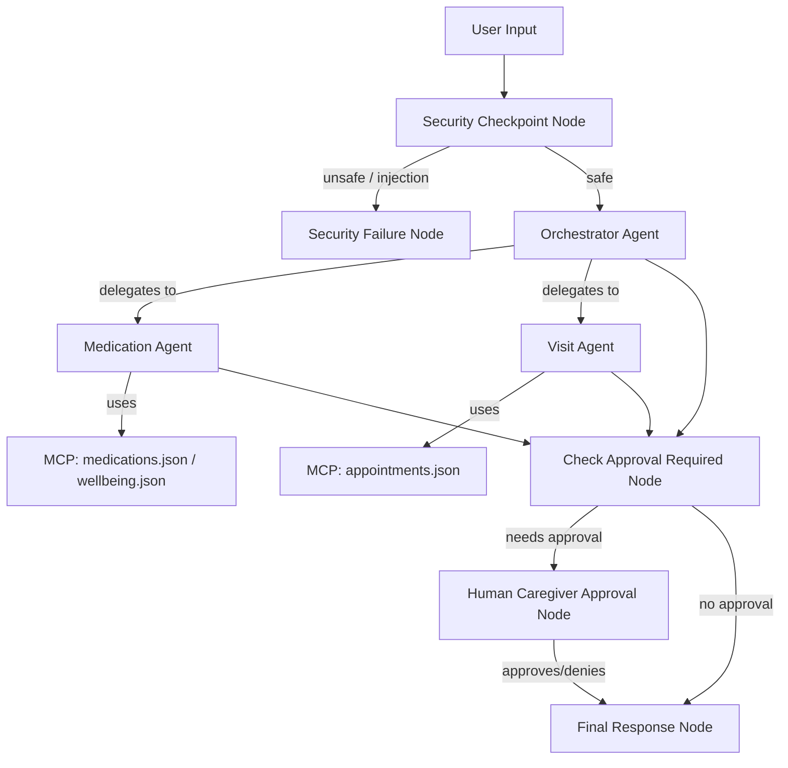

# Submission Write-Up: Elderly Care Assistant

## Problem Statement
Caring for elderly relatives often involves managing complex medication schedules, coordinating doctor visits, and tracking daily well-being metrics. These tasks are frequently managed using fragmented paper logs, spreadsheets, or group chats, leading to communication breakdowns, missed dosages, and uncoordinated care. The Elderly Care Assistant provides a secure, centralized, and intelligent coordinate system to automate these tasks while ensuring strict security and caregiver oversight.

## Solution Architecture

## Concepts Used
- **ADK Workflow**: Implemented as a graph-based state machine in [agent.py](app/agent.py) with explicit nodes, routes, and edge definitions.
- **LlmAgent**: Used for specialized sub-agents (`medication_agent` and `visit_agent`) and the coordinating `orchestrator` in [agent.py](app/agent.py).
- **AgentTool**: Utilized by the `orchestrator` in [agent.py](app/agent.py) to delegate specialized queries to the correct sub-agent.
- **MCP Server**: Implemented in [mcp_server.py](app/mcp_server.py) using the FastMCP framework to read and write records with standard JSON persistence files.
- **Security Checkpoint**: Implemented in [agent.py](app/agent.py) as a graph node that screens all queries before they reach any agent.
- **Agents CLI**: Project scaffolded, run, and verified using `agents-cli`.

## Security Design
- **PII Scrubbing**: Screens and replaces sensitive details (SSNs, phone numbers, and Medicare beneficiary numbers) using regex, replacing them with generic placeholders (e.g. `[REDACTED_SSN]`) to prevent leakages to the LLM.
- **Prompt Injection Detection**: Blocks queries containing instructions to bypass the agent's constraints.
- **Structured Audit Logging**: Outputs a JSON payload on every request detailing whether PII was found, whether injection was blocked, and the final decision (`safe` vs `unsafe`).
- **Domain Consent Check**: Enforces caregiver/doctor consent validation. Requests to share/email medical history without verified consent are automatically blocked.

## MCP Server Design
The server runs locally and exposes the following tools:
1. `add_medication`: Appends a medication schedule to `data/medications.json`.
2. `get_medications`: Retrieves current medication schedules.
3. `schedule_appointment`: Appends doctor visits to `data/appointments.json`.
4. `get_appointments`: Retrieves doctor appointments.
5. `log_wellbeing`: Records sleep, mood, and symptoms in `data/wellbeing.json`.

## HITL (Human-in-the-Loop) Flow
The workflow implements a caregiver verification gate. Any attempt to modify medication schedules or doctor appointments triggers `caregiver_needs_approval`. The workflow suspends execution and requests manual confirmation from the caregiver via `RequestInput`. If the caregiver responds with `yes`/`approve`, the modification is executed and saved; if they reply with `no`/`deny`, the action is aborted.

## Demo Walkthrough
- **Test Case 1 (Approval)**: Scheduling "Lisinopril 10mg daily at 8:00 AM" calls the MCP tool, triggers the HITL caregiver confirmation block, and saves it once approved.
- **Test Case 2 (Injection)**: Instructions to "Ignore previous rules" trigger the prompt injection detector, stopping the execution and routing immediately to the `security_failure` node.
- **Test Case 3 (PII Redaction)**: Inputs containing phone numbers and SSNs are scrubbed before reaching the orchestrator.

## Impact / Value Statement
The Elderly Care Assistant alleviates caregiver burden by providing a natural language interface to coordinate scheduling, records, and logs. By integrating local tool execution, data sanitization, and caregiver verification, it offers a secure, reliable, and user-friendly system for vulnerable populations and their families.
